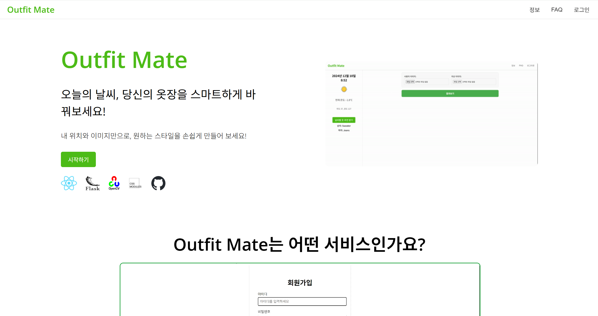
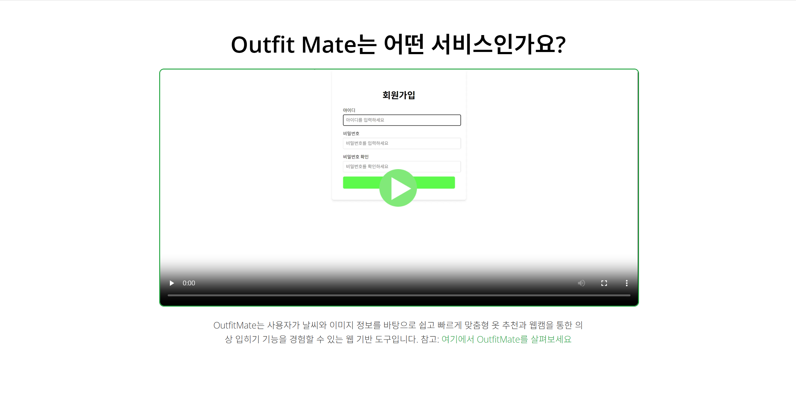
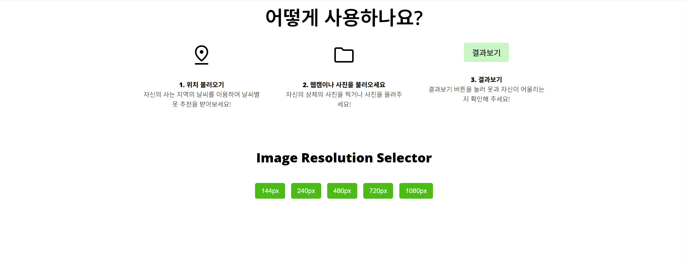
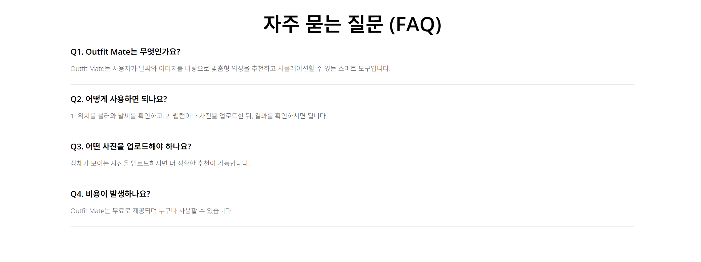
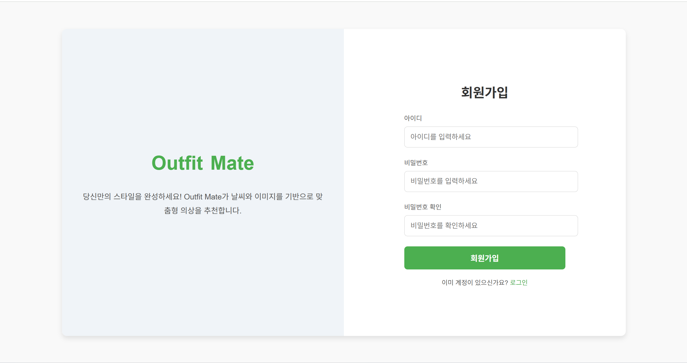
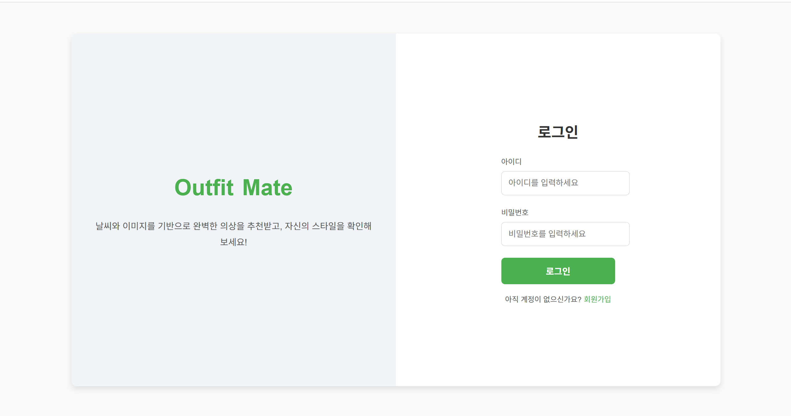
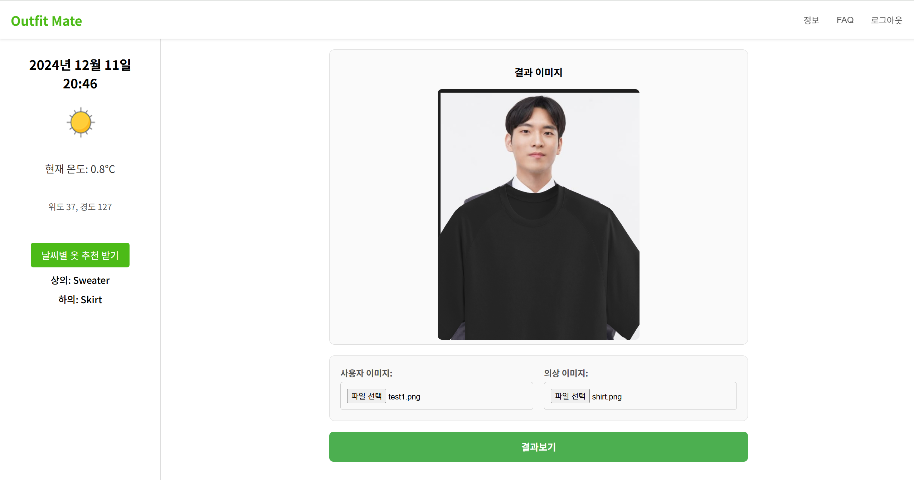

Here's the updated **README.md** file with your additional details about the motivation, challenges, and future expectations for the project:

---

# **Outfit Mate**

**Outfit Mate**는 날씨와 사용자의 이미지를 기반으로 의상을 추천하고 가상으로 피팅할 수 있는 웹 애플리케이션입니다. 사용자는 사진을 업로드하거나 웹캠을 통해 의상을 입혀보며, 날씨에 맞는 최적의 스타일을 추천받을 수 있습니다.

---

## **Table of Contents**

1. [Overview](#overview)
2. [Motivation](#motivation)
3. [Technologies Used](#technologies-used)
4. [Challenges](#challenges)
5. [Future Plans](#future-plans)
6. [Features](#features)
7. [Project Structure](#project-structure)
8. [Screenshots](#screenshots)
9. [How to Run](#how-to-run)
10. [Live Demo](#live-demo)
11. [Contact](#contact)

---

## **Overview**

**Outfit Mate**는 다음과 같은 문제를 해결합니다:

- 날씨에 따라 어떤 옷을 입어야 할지 고민됩니다.
- 온라인으로 옷을 살 때 내게 어울릴지 확신이 없습니다.

Outfit Mate는 이러한 고민을 줄이기 위해 날씨 데이터를 분석하고 사용자의 상체 이미지를 기반으로 의상을 추천 및 피팅해주는 스마트 웹 애플리케이션입니다.

---

## **Motivation**

**Outfit Mate를 만든 동기**  
옷을 온라인에서 구매하거나 날씨에 맞는 코디를 찾을 때, 사용자들이 자주 겪는 어려움을 해결하고자 이 프로젝트를 기획했습니다. 날씨와 상체 이미지를 활용해 사용자에게 어울리는 옷을 추천하고 가상으로 입혀봄으로써 **옷에 대한 걱정**을 덜어줄 수 있습니다.

---

## **Technologies Used**

| **Category**         | **Technologies**                    |
| -------------------- | ----------------------------------- |
| **Frontend**         | React.js, React Router, CSS Modules |
| **Backend**          | Flask (Python)                      |
| **Image Processing** | OpenCV, MediaPipe                   |
| **API**              | Weather API                         |
| **State Management** | React Hooks, Context API            |
| **Hosting**          | Local Flask Server                  |
| **Version Control**  | GitHub                              |

---

## **Challenges**

1. **백엔드 구현**

   - 백엔드를 처음 다루면서 로직의 흐름을 이해하는 데 어려움이 있었습니다.

2. **AI 모델**

   - AI 모델의 정확도가 낮아 최적의 결과를 내지 못한 점이 아쉽습니다.

3. **이미지 피팅**

   - OpenCV와 MediaPipe를 활용해 상체 랜드마크를 추출했지만, 의상 피팅이 완벽하지 않았습니다.

4. **데이터 부족**
   - 의상 데이터를 충분히 수집하지 못해 추천 모델의 성능이 아쉬웠습니다.

---

## **Future Plans**

1. **데이터 개선**

   - 무신사와 같은 패션 사이트에서 코디 데이터를 크롤링해 날씨별 코디 이미지를 추천하는 AI 모델을 개선할 계획입니다.

2. **웹캠 실시간 피팅**

   - 웹캠을 활용해 실시간으로 의상을 피팅할 수 있는 기능을 추가합니다.

3. **3D 피팅**
   - 3D 모델을 기반으로 하체까지 포함한 완벽한 의상 피팅 기능을 개발합니다.

---

## **Features**

1. **날씨에 따른 의상 추천**

   - 사용자의 위치 정보를 기반으로 날씨 데이터를 분석해 상의와 하의를 추천합니다.

2. **가상 의상 피팅**

   - 사용자가 업로드한 상체 이미지에 의상을 합성해 결과를 확인할 수 있습니다.

3. **로그인/회원가입 시스템**

   - 사용자는 계정을 생성하고 로그인해 서비스를 이용할 수 있습니다.

4. **직관적인 UI/UX**
   - 정보, FAQ, 의상 피팅 페이지가 직관적으로 설계되어 사용자 경험을 높였습니다.

---

## **Project Structure**

```bash
term_project/
│-- README.md                          # 프로젝트 설명 문서
│-- package.json                       # 프로젝트 설정 파일
│-- package-lock.json                  # npm 종속성 설정 파일
│-- shirt.png                          # 테스트용 의상 이미지
│-- smart_fitting_room.ipynb           # AI 모델 노트북 파일
│-- test.jpg                           # 테스트용 사용자 이미지
│-- test1.png                          # 결과 이미지
│-- wearher_outfit_reco.ipynb          # 날씨 기반 의상 추천 노트북
│
├── flask-server/                      # 백엔드 서버 폴더
│   ├── requirements.txt               # Flask 프로젝트 종속성
│   ├── server.py                      # 백엔드 Flask 서버 메인 파일
│   ├── venv/                          # 가상 환경
│   └── data/                          # 추가 데이터 파일 (의상 추천 모델 학습 데이터 등)
│
├── OutfitMate/                        # 프론트엔드 React 프로젝트
│   │-- .gitignore                     # Git에서 제외할 파일 목록
│   │-- index.html                     # 기본 HTML 파일
│   │-- eslint.config.js               # ESLint 설정 파일
│   │-- vite.config.js                 # Vite 설정 파일
│   │-- package.json                   # React 프로젝트 설정 파일
│   │-- package-lock.json              # npm 종속성 설정 파일
│   │
│   ├── public/                        # Static 파일 (전역 접근 가능)
│   │   ├── Logo.png                   # OutfitMate 로고
│   │   └── vite.svg                   # Vite 기본 이미지
│   │
│   ├── src/                           # React 소스 코드
│   │   │-- App.jsx                    # 메인 컴포넌트
│   │   │-- AuthContext.jsx            # 인증 상태 관리
│   │   │-- main.jsx                   # React 렌더링 엔트리 포인트
│   │   │-- App.css                    # 글로벌 스타일
│   │   │-- index.css                  # 초기화 스타일
│   │
│   │   ├── Component/                 # 재사용 가능한 컴포넌트
│   │   │   ├── ImageSelector.jsx      # 이미지 업로드 컴포넌트
│   │   │   ├── ImageSelector.module.css # 이미지 선택 스타일
│   │   │   ├── Login.jsx              # 로그인 페이지 컴포넌트
│   │   │   ├── Login.module.css       # 로그인 스타일
│   │   │   ├── Singup.jsx             # 회원가입 페이지 컴포넌트
│   │   │   └── Signup.module.css      # 회원가입 스타일
│   │
│   │   ├── Page/                      # 주요 페이지 컴포넌트
│   │   │   ├── Home.jsx               # 홈 페이지
│   │   │   ├── Home.module.css        # 홈 페이지 스타일
│   │   │   ├── Detail.jsx             # 의상 피팅 및 날씨 추천 페이지
│   │   │   ├── Detail.module.css      # Detail 페이지 스타일
│   │   │   └── Static/                # 정적 파일 및 아이콘
│   │   │       ├── weather_images/    # 날씨 아이콘 폴더
│   │   │       ├── css-modules-logo.png
│   │   │       ├── flask.png
│   │   │       ├── folder.png
│   │   │       ├── gif.gif            # 설명용 GIF
│   │   │       ├── github-mark.svg
│   │   │       ├── location-icon.png
│   │   │       ├── opencv-icon.png
│   │   │       ├── outfitmate.mp4     # 홍보 및 설명용 동영상
│   │   │       ├── panda-image.png    # 테스트 이미지
│   │   │       ├── play-button.png
│   │   │       └── React-ico.png
│   │
│   └── node_modules/                  # npm 종속성 폴더
│
└── node_modules/                      # 루트 경로 npm 종속성 폴더

```

---

## **Screenshots**

### **홈 페이지**

#### **메인 화면**

  
Outfit Mate의 메인 화면으로, **날씨와 이미지 기반 맞춤형 의상 추천** 서비스를 소개합니다.  
여기서 "시작하기" 버튼을 눌러 서비스를 체험할 수 있습니다.

#### **Outfit Mate 서비스 소개 영상**

  
Outfit Mate의 기능과 특징을 보여주는 **소개 영상**입니다.  
아래의 링크를 통해 직접 영상을 확인할 수 있습니다:

<video width="600" controls>
  <source src="images/outfitmate.mp4" type="video/mp4">
  사용 중인 브라우저는 비디오 태그를 지원하지 않습니다.
</video>

#### **사용 방법 안내**

  
Outfit Mate를 사용하는 **세 가지 간단한 단계**를 안내합니다:

1. **위치 불러오기**: 날씨 데이터를 기반으로 의상을 추천받습니다.
2. **이미지 업로드**: 사용자 사진과 의상 이미지를 업로드합니다.
3. **결과 확인**: 의상 피팅 결과를 확인하고 스타일을 조정해보세요.

재미있는 UI 요소와 함께, 사용자 경험을 더욱 풍부하게 제공합니다.

#### **자주 묻는 질문 (FAQ)**

  
Outfit Mate의 궁금한 점과 핵심 기능에 대한 **FAQ 섹션**입니다.  
사용 중 궁금한 점이 있다면 이 섹션을 참고해주세요!

---

### **회원가입 페이지**

  
Outfit Mate의 **회원가입 페이지**입니다.

- 사용자는 간단한 정보 (아이디, 비밀번호)를 입력하여 계정을 생성할 수 있습니다.
- 비밀번호 확인 필드와 입력 검증 기능을 제공하여 안전한 회원가입을 보장합니다.

---

### **로그인 페이지**

  
Outfit Mate의 **로그인 페이지**입니다.

- 이미 계정이 있다면 아이디와 비밀번호를 입력해 로그인할 수 있습니다.
- 계정이 없다면 **회원가입 링크**를 통해 계정을 새로 만들 수 있습니다.
- 간결한 UI와 직관적인 입력 필드를 제공하여 사용자가 쉽게 접근할 수 있습니다.

---

### **날씨 추천 및 의상 피팅**

#### **날씨 기반 의상 추천**

  
사용자의 **위치와 날씨** 정보를 기반으로 상의와 하의를 추천해줍니다.

- 위치를 불러와 현재 날씨를 확인합니다.
- AI 모델이 날씨에 맞는 의상을 추천해드립니다.

#### **의상 피팅 결과**

업로드한 사용자 이미지와 의상 이미지를 결합하여 **의상 피팅 결과**를 제공합니다.

- OpenCV와 MediaPipe를 활용해 사용자의 상체에 의상을 합성합니다.
- "결과보기" 버튼을 통해 가상으로 입은 의상을 확인할 수 있습니다.

---

### **기능 요약**

- **날씨 추천**: 현재 날씨에 적합한 의상을 추천.
- **이미지 기반 피팅**: 사용자의 이미지에 맞게 의상을 합성.
- **간단한 사용법**: 3단계로 누구나 쉽게 사용할 수 있는 UI.

Outfit Mate는 온라인에서 옷을 고를 때 발생하는 걱정을 덜어주고, 새로운 스타일을 제안하는 스마트 도구입니다! 🎉

---

## **Live Demo**

서비스를 직접 체험해보세요! 🎉

**[Outfit Mate - Live Site](https://outfitmate.web.app)**

---

## **How to Run**

### **Frontend**

1. 프로젝트 폴더로 이동:

   ```bash
   cd OutfitmMte
   npm install
   npm run dev
   ```

2. **http://localhost:5173/** 에서 프론트엔드를 확인할 수 있습니다.

### **Backend**

1. 백엔드 폴더로 이동:

   ```bash
   cd flask-server
   pip install -r requirements.txt
   python server.py
   ```

2. **http://127.0.0.1:5000**에서 API 서버가 실행됩니다.

---

## **Contact**

- **GitHub**: [Outfit Mate Repository](https://github.com/kkh041124/UNIV_OSS)
- **Team Members**: Outfit Mate 개발팀

---

### **Thank You!**

Outfit Mate는 사용자 경험을 바탕으로 더 나은 서비스를 제공하기 위해 끊임없이 발전하겠습니다!
